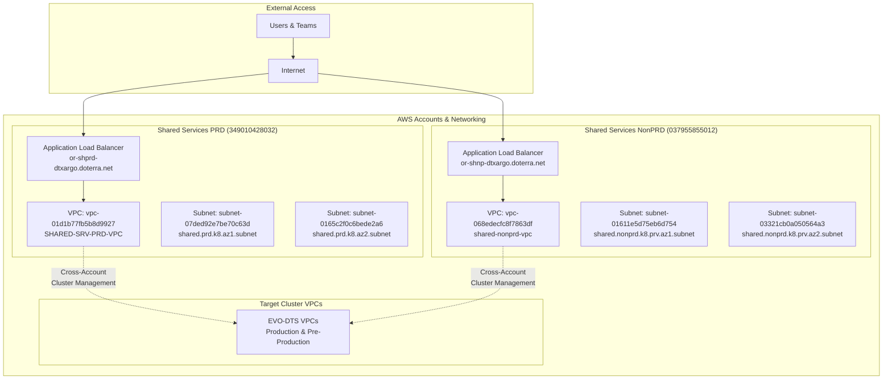
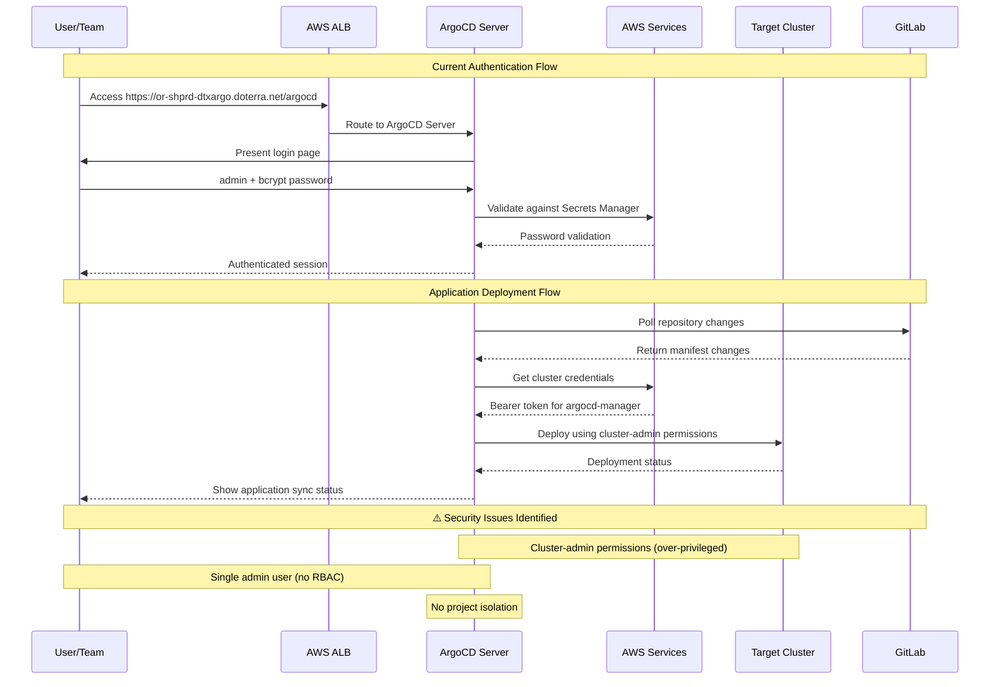

# ArgoCD Infrastructure Architecture Diagram

## Complete Infrastructure Flow

```mermaid
graph TB
    subgraph "External Services"
        AWS[AWS Services<br/>- Secrets Manager<br/>- ECR<br/>- EKS<br/>- VPC]
        SSO[AWS SSO<br/>d-9267735cf2.awsapps.com]
    end

    subgraph "GitLab Infrastructure (git.doterra.net)"
        GL[GitLab Server<br/>https://git.doterra.net/]
        
        subgraph "Source Repositories"
            DTS_REPO[DTS Mono<br/>application-stack/datatrax/dts/dts-mono.git]
            DOT_REPO[Doterra App<br/>application-stack/datatrax/evo/doterra.git]
            SHOP_REPO[ShopDoterra<br/>application-stack/datatrax/evo/shopdoterra.git]
        end
        
        subgraph "Container Registries"
            ECR_NP[NonProd ECR<br/>037955855012.dkr.ecr.us-west-2.amazonaws.com]
            ECR_P[Prod ECR<br/>349010428032.dkr.ecr.us-west-2.amazonaws.com]
        end
    end
    
    subgraph "Shared Services Account - Production (349010428032)"
        subgraph "EKS Cluster: gitlab-runs-prd"
            subgraph "ArgoCD Control Plane"
                AC_P[ArgoCD Server v5.29.1<br/>https://or-shprd-dtxargo.doterra.net/argocd]
                REDIS_P[Redis Cache]
                REPO_P[Repository Server]
                CTRL_P[Application Controller]
            end
            
            subgraph "Infrastructure Components"
                HAP_P[HAProxy Ingress v1.40.0<br/>LoadBalancer Service]
                KAR_P[Karpenter v1.5.0<br/>Node Autoscaling]
                MS_P[Metrics Server v3.12.0]
            end
            
            subgraph "GitLab Runners"
                GR_INFRA_P[Infrastructure Runner v0.67.1<br/>concurrent: 10]
                GR_APP_P[Application Runner v0.67.1<br/>privileged: true]
            end
        end
    end
    
    subgraph "Shared Services Account - NonProd (037955855012)"
        subgraph "EKS Cluster: gitlab-runs-noprd"
            subgraph "ArgoCD Control Plane"
                AC_NP[ArgoCD Server v5.29.1<br/>https://or-shnp-dtxargo.doterra.net/argocd]
                REDIS_NP[Redis Cache]
                REPO_NP[Repository Server]
                CTRL_NP[Application Controller]
            end
            
            subgraph "Infrastructure Components"
                HAP_NP[HAProxy Ingress v1.40.0]
                KAR_NP[Karpenter v1.5.0]
                MS_NP[Metrics Server v3.12.0]
            end
            
            subgraph "GitLab Runners"
                GR_INFRA_NP[Infrastructure Runner v0.67.1]
                GR_APP_NP[Application Runner v0.67.1]
            end
        end
    end
    
    subgraph "Target Application Clusters"
        subgraph "EVO-DTS Production"
            subgraph "EKS Cluster: evo-dts-prd (k8s v1.33)"
                SA1[argocd-manager ServiceAccount<br/>⚠️ cluster-admin permissions]
                
                subgraph "Application Deployments"
                    APP1[DTS Application<br/>namespace: dts<br/>values-prd.yaml]
                    APP2[Doterra Application<br/>namespace: evo<br/>values-prd.yaml]
                    APP3[ShopDoterra Application<br/>namespace: evo<br/>values-prd.yaml]
                end
                
                subgraph "Supporting Services"
                    EFS1[AWS EFS CSI Driver<br/>Persistent Storage]
                    ROLLOUTS1[Argo Rollouts<br/>Blue/Green Deployments]
                    HAP1[HAProxy Ingress]
                    KARP1[Karpenter<br/>Node Scaling]
                end
            end
        end
        
        subgraph "EVO-DTS Pre-Production"
            subgraph "EKS Cluster: evo-dts-prf (k8s v1.33)"
                SA2[argocd-manager ServiceAccount<br/>⚠️ cluster-admin permissions]
                
                subgraph "Application Deployments"
                    APP4[DTS Application<br/>namespace: dts<br/>values-prf.yaml]
                    APP5[Doterra Application<br/>namespace: evo<br/>values-prf.yaml]
                    APP6[ShopDoterra Application<br/>namespace: evo<br/>values-prf.yaml]
                end
                
                subgraph "Supporting Services"
                    EFS2[AWS EFS CSI Driver]
                    ROLLOUTS2[Argo Rollouts]
                    HAP2[HAProxy Ingress]
                    KARP2[Karpenter]
                end
            end
        end
    end

    %% Connections
    GL --> DTS_REPO
    GL --> DOT_REPO
    GL --> SHOP_REPO
    
    DTS_REPO --> GR_APP_P
    DOT_REPO --> GR_APP_P
    SHOP_REPO --> GR_APP_P
    
    GR_APP_P --> ECR_P
    GR_APP_NP --> ECR_NP
    
    %% ArgoCD manages target clusters
    AC_P -.->|Cluster Secret<br/>Bearer Token Auth| SA1
    AC_NP -.->|Cluster Secret<br/>Bearer Token Auth| SA2
    
    %% ArgoCD pulls from Git repos
    REPO_P --> DTS_REPO
    REPO_P --> DOT_REPO  
    REPO_P --> SHOP_REPO
    REPO_NP --> DTS_REPO
    REPO_NP --> DOT_REPO
    REPO_NP --> SHOP_REPO
    
    %% Service account deploys applications
    SA1 --> APP1
    SA1 --> APP2
    SA1 --> APP3
    SA2 --> APP4
    SA2 --> APP5
    SA2 --> APP6
    
    %% External service connections
    AWS -.-> AC_P
    AWS -.-> AC_NP
    AWS -.-> SA1
    AWS -.-> SA2
    SSO -.->|Future Integration| AC_P
    SSO -.->|Future Integration| AC_NP

    %% Load balancer connections
    HAP_P --> AC_P
    HAP_NP --> AC_NP

    classDef production fill:#ff9999,stroke:#333,stroke-width:2px
    classDef nonprod fill:#99ccff,stroke:#333,stroke-width:2px
    classDef security fill:#ffcc99,stroke:#333,stroke-width:2px
    classDef external fill:#ccffcc,stroke:#333,stroke-width:2px
    
    class AC_P,GR_INFRA_P,GR_APP_P,HAP_P,KAR_P,MS_P,SA1,APP1,APP2,APP3,EFS1,ROLLOUTS1,HAP1,KARP1 production
    class AC_NP,GR_INFRA_NP,GR_APP_NP,HAP_NP,KAR_NP,MS_NP,SA2,APP4,APP5,APP6,EFS2,ROLLOUTS2,HAP2,KARP2 nonprod
    class SA1,SA2 security
    class AWS,SSO,GL,ECR_P,ECR_NP external
```

## Network Architecture

## Security & Authentication Flow

## Key URLs & Endpoints Reference

| Component | Environment | URL/Endpoint |
|-----------|-------------|--------------|
| **ArgoCD Web UI** | Production | https://or-shprd-dtxargo.doterra.net/argocd |
| **ArgoCD Web UI** | Non-Production | https://or-shnp-dtxargo.doterra.net/argocd |
| **GitLab** | All | https://git.doterra.net/ |
| **ECR NonProd** | NonProd | 037955855012.dkr.ecr.us-west-2.amazonaws.com |
| **ECR Prod** | Production | 349010428032.dkr.ecr.us-west-2.amazonaws.com |
| **AWS SSO** | All | https://d-9267735cf2.awsapps.com/start/# |

## Component Versions Summary

| Component | Version | Repository |
|-----------|---------|------------|
| ArgoCD | 5.29.1 | https://argoproj.github.io/argo-helm |
| Karpenter | 1.5.0 | oci://public.ecr.aws/karpenter |
| HAProxy Ingress | 1.40.0 | https://haproxytech.github.io/helm-charts |
| GitLab Runner | 0.67.1 | https://charts.gitlab.io |
| Metrics Server | 3.12.0 | https://kubernetes-sigs.github.io/metrics-server/ |
| Kubernetes | 1.33 | AWS EKS |
| Terraform | >= 1.3.2 | HashiCorp |
| AWS Provider | >= 5.75.0 | HashiCorp |