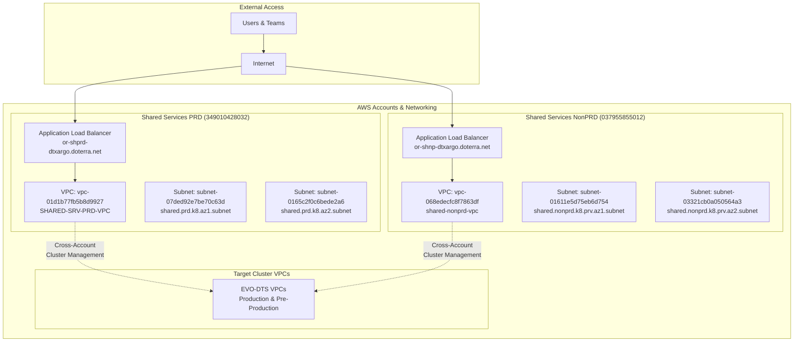
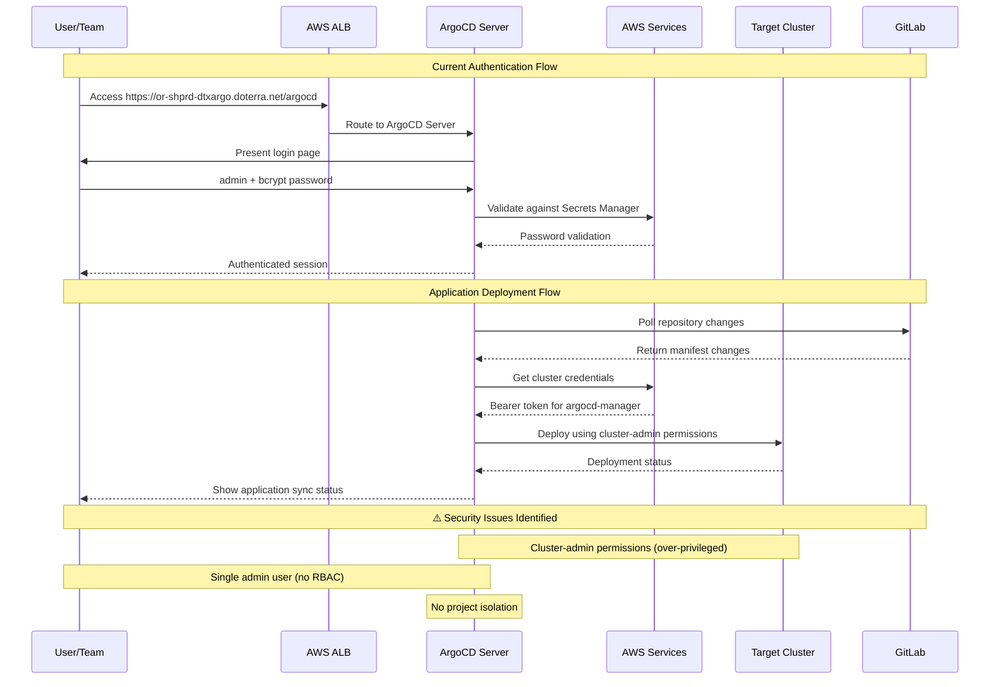

```mermaid
graph TB
    subgraph "External Services"
        AWS[AWS Services<br/>- Secrets Manager<br/>- ECR<br/>- EKS<br/>- VPC]
        SSO[AWS SSO<br/>d-9267735cf2.awsapps.com]
    end

    subgraph "GitLab Infrastructure (git.doterra.net)"
        GL[GitLab Server<br/>https://git.doterra.net/]
        
        subgraph "Source Repositories"
            DTS_REPO[DTS Mono<br/>application-stack/datatrax/dts/dts-mono.git]
            DOT_REPO[Doterra App<br/>application-stack/datatrax/evo/doterra.git]
            SHOP_REPO[ShopDoterra<br/>application-stack/datatrax/evo/shopdoterra.git]
        end
        
        subgraph "Container Registries"
            ECR_NP[NonProd ECR<br/>037955855012.dkr.ecr.us-west-2.amazonaws.com]
            ECR_P[Prod ECR<br/>349010428032.dkr.ecr.us-west-2.amazonaws.com]
        end
    end
    
    subgraph "Shared Services Account - Production (349010428032)"
        subgraph "EKS Cluster: gitlab-runs-prd"
            subgraph "ArgoCD Control Plane"
                AC_P[ArgoCD Server v5.29.1<br/>https://or-shprd-dtxargo.doterra.net/argocd]
                REDIS_P[Redis Cache]
                REPO_P[Repository Server]
                CTRL_P[Application Controller]
            end
            
            subgraph "Infrastructure Components"
                HAP_P[HAProxy Ingress v1.40.0<br/>LoadBalancer Service]
                KAR_P[Karpenter v1.5.0<br/>Node Autoscaling]
                MS_P[Metrics Server v3.12.0]
            end
            
            subgraph "GitLab Runners"
                GR_INFRA_P[Infrastructure Runner v0.67.1<br/>concurrent: 10]
                GR_APP_P[Application Runner v0.67.1<br/>privileged: true]
            end
        end
    end
    
    subgraph "Shared Services Account - NonProd (037955855012)"
        subgraph "EKS Cluster: gitlab-runs-noprd"
            subgraph "ArgoCD Control Plane"
                AC_NP[ArgoCD Server v5.29.1<br/>https://or-shnp-dtxargo.doterra.net/argocd]
                REDIS_NP[Redis Cache]
                REPO_NP[Repository Server]
                CTRL_NP[Application Controller]
            end
            
            subgraph "Infrastructure Components"
                HAP_NP[HAProxy Ingress v1.40.0]
                KAR_NP[Karpenter v1.5.0]
                MS_NP[Metrics Server v3.12.0]
            end
            
            subgraph "GitLab Runners"
                GR_INFRA_NP[Infrastructure Runner v0.67.1]
                GR_APP_NP[Application Runner v0.67.1]
            end
        end
    end
    
    subgraph "Target Application Clusters"
        subgraph "EVO-DTS Production"
            subgraph "EKS Cluster: evo-dts-prd (k8s v1.33)"
                SA1[argocd-manager ServiceAccount<br/>⚠️ cluster-admin permissions]
                
                subgraph "Application Deployments"
                    APP1[DTS Application<br/>namespace: dts<br/>values-prd.yaml]
                    APP2[Doterra Application<br/>namespace: evo<br/>values-prd.yaml]
                    APP3[ShopDoterra Application<br/>namespace: evo<br/>values-prd.yaml]
                end
                
                subgraph "Supporting Services"
                    EFS1[AWS EFS CSI Driver<br/>Persistent Storage]
                    ROLLOUTS1[Argo Rollouts<br/>Blue/Green Deployments]
                    HAP1[HAProxy Ingress]
                    KARP1[Karpenter<br/>Node Scaling]
                end
            end
        end
        
        subgraph "EVO-DTS Pre-Production"
            subgraph "EKS Cluster: evo-dts-prf (k8s v1.33)"
                SA2[argocd-manager ServiceAccount<br/>⚠️ cluster-admin permissions]
                
                subgraph "Application Deployments"
                    APP4[DTS Application<br/>namespace: dts<br/>values-prf.yaml]
                    APP5[Doterra Application<br/>namespace: evo<br/>values-prf.yaml]
                    APP6[ShopDoterra Application<br/>namespace: evo<br/>values-prf.yaml]
                end
                
                subgraph "Supporting Services"
                    EFS2[AWS EFS CSI Driver]
                    ROLLOUTS2[Argo Rollouts]
                    HAP2[HAProxy Ingress]
                    KARP2[Karpenter]
                end
            end
        end
    end

    %% Connections
    GL --> DTS_REPO
    GL --> DOT_REPO
    GL --> SHOP_REPO
    
    DTS_REPO --> GR_APP_P
    DOT_REPO --> GR_APP_P
    SHOP_REPO --> GR_APP_P
    
    GR_APP_P --> ECR_P
    GR_APP_NP --> ECR_NP
    
    %% ArgoCD manages target clusters
    AC_P -.->|Cluster Secret<br/>Bearer Token Auth| SA1
    AC_NP -.->|Cluster Secret<br/>Bearer Token Auth| SA2
    
    %% ArgoCD pulls from Git repos
    REPO_P --> DTS_REPO
    REPO_P --> DOT_REPO  
    REPO_P --> SHOP_REPO
    REPO_NP --> DTS_REPO
    REPO_NP --> DOT_REPO
    REPO_NP --> SHOP_REPO
    
    %% Service account deploys applications
    SA1 --> APP1
    SA1 --> APP2
    SA1 --> APP3
    SA2 --> APP4
    SA2 --> APP5
    SA2 --> APP6
    
    %% External service connections
    AWS -.-> AC_P
    AWS -.-> AC_NP
    AWS -.-> SA1
    AWS -.-> SA2
    SSO -.->|Future Integration| AC_P
    SSO -.->|Future Integration| AC_NP

    %% Load balancer connections
    HAP_P --> AC_P
    HAP_NP --> AC_NP

    classDef production fill:#ff9999,stroke:#333,stroke-width:2px
    classDef nonprod fill:#99ccff,stroke:#333,stroke-width:2px
    classDef security fill:#ffcc99,stroke:#333,stroke-width:2px
    classDef external fill:#ccffcc,stroke:#333,stroke-width:2px
    
    class AC_P,GR_INFRA_P,GR_APP_P,HAP_P,KAR_P,MS_P,SA1,APP1,APP2,APP3,EFS1,ROLLOUTS1,HAP1,KARP1 production
    class AC_NP,GR_INFRA_NP,GR_APP_NP,HAP_NP,KAR_NP,MS_NP,SA2,APP4,APP5,APP6,EFS2,ROLLOUTS2,HAP2,KARP2 nonprod
    class SA1,SA2 security
    class AWS,SSO,GL,ECR_P,ECR_NP external
```

# Complete ArgoCD Infrastructure Analysis & Multi-Tenant Migration Guide

## Table of Contents
1. [🌐 End URLs & Access Points](#-end-urls--access-points)
2. [🏗️ Current Infrastructure Components](#️-current-infrastructure-components)
3. [📦 Helm Charts & Versions](#-helm-charts--versions)
4. [⚙️ Custom Configurations vs Defaults](#️-custom-configurations-vs-defaults)
5. [🔄 Architecture Flow Diagrams](#-architecture-flow-diagrams)
6. [🏛️ Current ArgoCD Setup Architecture](#️-current-argocd-setup-architecture)
7. [🚨 Multi-Tenant Migration Analysis](#-multi-tenant-migration-analysis)
8. [📋 Implementation Recommendations](#-implementation-recommendations)

---

## 🌐 End URLs & Access Points

### **ArgoCD Web UI Endpoints:**
- **Production**: `https://or-shprd-dtxargo.doterra.net/argocd`
- **Non-Production**: `https://or-shnp-dtxargo.doterra.net/argocd`

### **GitLab Integration:**
- **Primary GitLab**: `https://git.doterra.net/`
- **CI/CD Pipelines**: GitLab CI with AWS ECR integration
- **Container Registries**: 
  - NonProd: `037955855012.dkr.ecr.us-west-2.amazonaws.com`
  - Prod: `349010428032.dkr.ecr.us-west-2.amazonaws.com`

### **Application Source Repositories:**
- **DTS**: `https://git.doterra.net/application-stack/datatrax/dts/dts-mono.git`
- **Doterra**: `https://git.doterra.net/application-stack/datatrax/evo/doterra.git`
- **ShopDoterra**: `https://git.doterra.net/application-stack/datatrax/evo/shopdoterra.git`

### **AWS SSO Integration:**
- **SSO Portal**: `https://d-9267735cf2.awsapps.com/start/#`

### **Terraform State Management:**
- **Production**: `https://git.doterra.net/api/v4/projects/1659/terraform/state/Shared_Services_PRD`
- **Non-Production**: `https://git.doterra.net/api/v4/projects/1659/terraform/state/Shared_Services_NonPRD`
- **EVO-DTS PRD**: `https://git.doterra.net/api/v4/projects/1667/terraform/state/prd`
- **EVO-DTS PRF**: `https://git.doterra.net/api/v4/projects/1667/terraform/state/prf`

---

## 🏗️ Current Infrastructure Components

### **Shared Services Clusters (Control Plane):**
```yaml
Production Environment:
  Account: "349010428032"
  Cluster: "gitlab-runs-prd"
  Region: "us-west-2"
  VPC: "vpc-01d1b77fb5b8d9927" # SHARED-SRV-PRD-VPC
  Subnets: 
    - "subnet-07ded92e7be70c63d" # shared.prd.k8.az1.subnet
    - "subnet-0165c2f0c6bede2a6" # shared.prd.k8.az2.subnet
  DNS: "or-shprd-dtxargo.doterra.net"

Non-Production Environment:
  Account: "037955855012"
  Cluster: "gitlab-runs-noprd" 
  Region: "us-west-2"
  VPC: "vpc-068edecfc8f7863df" # shared-nonprd-vpc
  Subnets:
    - "subnet-01611e5d75eb6d754" # shared.nonprd.k8.prv.az1.subnet
    - "subnet-03321cb0a050564a3" # shared.nonprd.k8.prv.az2.subnet
  DNS: "or-shnp-dtxargo.doterra.net"
```

### **Target Application Clusters (Managed by ArgoCD):**
```yaml
EVO-DTS Production:
  Cluster: "evo-dts-prd"
  Kubernetes: "1.33"
  Region: "us-west-2"
  Applications:
    - DTS (namespace: dts)
    - Doterra (namespace: evo)
    - ShopDoterra (namespace: evo)

EVO-DTS Pre-Production:
  Cluster: "evo-dts-prf"
  Kubernetes: "1.33"
  Region: "us-west-2"
  Applications:
    - DTS (namespace: dts)
    - Doterra (namespace: evo) 
    - ShopDoterra (namespace: evo)
```

### **Infrastructure Services Deployed:**
```yaml
ArgoCD Components:
  - ArgoCD Server (API Server + Web UI)
  - Application Controller
  - Repository Server
  - Redis Cache
  - Dex (OIDC Provider - Not configured)
  - ApplicationSet Controller
  - Notifications Controller

Supporting Infrastructure:
  - HAProxy Ingress Controller
  - Karpenter (Node Autoscaling)
  - AWS EFS CSI Driver
  - Metrics Server
  - Argo Rollouts
  - GitLab Runners (Infrastructure & Application stacks)
```

---

## 📦 Helm Charts & Versions

### **ArgoCD Stack:**
```yaml
ArgoCD:
  Chart: "argo-cd"
  Version: "5.29.1"
  Repository: "https://argoproj.github.io/argo-helm"
  Namespace: "argocd"
  Custom Values: "/values/argocd/values.yaml"

Argo Rollouts: 
  Chart: "argo-rollouts"
  Repository: "https://argoproj.github.io/argo-helm"
  Version: "Variable (per environment)"
  Namespace: "argo-rollouts"
```

### **Infrastructure Components:**
```yaml
Karpenter:
  Chart: "karpenter"
  Version: "1.5.0" 
  Repository: "oci://public.ecr.aws/karpenter"
  Namespace: "karpenter"

HAProxy Ingress:
  Chart: "kubernetes-ingress"
  Version: "1.40.0"
  Repository: "https://haproxytech.github.io/helm-charts"
  Namespace: "haproxy-controller"

Metrics Server:
  Chart: "metrics-server"
  Version: "3.12.0"
  Repository: "https://kubernetes-sigs.github.io/metrics-server/"
  Namespace: "kube-system"

GitLab Runner:
  Chart: "gitlab-runner"
  Version: "0.67.1"
  Repository: "https://charts.gitlab.io"
  Types: 
    - Infrastructure Stack Runner
    - Application Stack Runner

AWS EFS CSI Driver:
  Chart: "aws-efs-csi-driver"
  Repository: "https://kubernetes-sigs.github.io/aws-efs-csi-driver/"
  Namespace: "kube-system"
```

### **Terraform Providers & Versions:**
```yaml
Terraform: ">= 1.3.2"
Providers:
  AWS: ">=5.75.0"
  Helm: ">= 2.14.0" 
  Kubernetes: ">= 2.31.0"
  Kubectl: ">= 1.14.0"
  BCrypt: ">= 0.1.2"
  Random: ">= 3.6.2"
```

---

## ⚙️ Custom Configurations vs Defaults

### **ArgoCD Custom Settings:**
```yaml
Custom Configuration:
  server.rootpath: "/argocd"        # Behind HAProxy reverse proxy
  server.insecure: true             # TLS termination at ALB
  argocdServerAdminPassword: "${argocd_password}"  # AWS Secrets Manager
  
Node Scheduling:
  tolerations:
    - key: "CriticalAddonsOnly"
      operator: "Exists" 
      effect: "NoSchedule"
  
Applied To: server, controller, repoServer, dex, redis, applicationSet, notifications

Repository Server:
  extraArgs: ["--allow-oob-symlinks"]   # Allow out-of-bounds symlinks
  
Default Behavior (NOT Configured):
  - Single admin user (no RBAC)
  - All applications in "default" project
  - No SSO integration
  - No project-based isolation
```

### **GitLab Runner Custom Settings:**
```yaml
Infrastructure Stack Runner:
  gitlabUrl: "https://git.doterra.net/"
  concurrent: 10
  privileged: true
  checkInterval: 30
  
  RBAC Permissions:
    - pods: ["list", "get", "watch", "create", "delete"]
    - pods/exec: ["create"]
    - pods/log: ["get"]
    - pods/attach: ["list", "get", "create", "delete", "update"]
    - secrets: ["list", "get", "create", "delete", "update"]
    - configmaps: ["list", "get", "create", "delete", "update"]

  S3 Cache Configuration:
    ServerAddress: "s3.amazonaws.com"
    BucketName: "gitlab-runner-cache"
    
  ServiceAccount Annotation:
    eks.amazonaws.com/role-arn: "arn:aws:iam::{account}:role/gitlab-runners"

Application Stack Runner:
  - Similar configuration but separate runner instance
  - Dedicated for application deployments
  - Same RBAC and caching setup
```

### **HAProxy Ingress Custom Settings:**
```yaml
Controller Service:
  type: "LoadBalancer"           # AWS ALB integration
  enablePorts:
    http: true
    https: true
    quic: false                  # QUIC disabled
    stat: false                  # Stats endpoint disabled
    prometheus: false            # Prometheus metrics disabled
    
  annotations:
    service.beta.kubernetes.io/aws-load-balancer-connection-idle-timeout: "${timeout}"
    
SSL/TLS:
  defaultTLSSecret:
    enabled: false               # TLS handled by AWS ALB
  
SSL Certificate Management:
  secret_store_name: "doterra_net_ssl"
  Source: AWS Secrets Manager
  Format: JSON with 'crt' and 'key' fields
```

### **Security Configuration Analysis:**
```yaml
Service Accounts (⚠️ SECURITY CONCERNS):
  argocd-manager:
    permissions: "cluster-admin"  # OVER-PRIVILEGED
    namespace: "kube-system"
    token_type: "kubernetes.io/service-account-token"
    
  Cluster Role Rules:
    - apiGroups: ["*"]
      resources: ["*"] 
      verbs: ["*"]                # Full cluster access
    - nonResourceURLs: ["*"]
      verbs: ["*"]                # All non-resource URLs
      
AWS Integration:
  EKS Pod Identity: Enabled
  ECR Authentication: Custom credential helper
  Secrets Manager: Password and certificate storage
  
Authentication Flow:
  1. User → AWS ALB → ArgoCD Server
  2. ArgoCD → AWS Secrets Manager (password validation)
  3. ArgoCD → Target Cluster (bearer token auth)
  4. Target Cluster → Applications (cluster-admin permissions)
```

---

## 🔄 Architecture Flow Diagrams

### Complete Infrastructure Flow



### Network Architecture



### Security & Authentication Flow



---

## 🏛️ Current ArgoCD Setup Architecture

### **Repository Structure Analysis:**

#### **Repository 1: gitlab-runners (Control Plane)**
```yaml
Role: ArgoCD Control Plane & CI/CD Infrastructure
Location: Shared Services clusters (NonPRD & PRD accounts)
Purpose: Centralized ArgoCD server managing multiple target clusters

Components Deployed:
  - ArgoCD Server (Helm chart v5.29.1)
  - Admin password via AWS Secrets Manager with bcrypt hashing
  - HAProxy ingress with custom path /argocd
  - GitLab Runners for Infrastructure & Application stacks
  - All components with "CriticalAddonsOnly" node tolerations

File Structure:
  ├── envs/
  │   ├── Shared_Services_PRD/
  │   │   ├── eks-argocd.tf          # ArgoCD installation
  │   │   ├── values/argocd/values.yaml
  │   │   └── data.tf                # DNS: or-shprd-dtxargo.doterra.net
  │   └── Shared_Services_NonPRD/
  │       ├── eks-argocd.tf
  │       ├── values/argocd/values.yaml
  │       └── data.tf                # DNS: or-shnp-dtxargo.doterra.net
```

#### **Repository 2: evo-dts (Target Clusters)**
```yaml
Role: Application clusters managed by ArgoCD
Location: Application environments (prd/prf)
Purpose: Deploy and manage business applications

Components Deployed:
  - argocd-manager service account with cluster-admin permissions
  - Cluster registration with centralized ArgoCD
  - GitLab repository access configuration
  - Application definitions for DTS, Doterra, ShopDoterra

File Structure:
  ├── terraform/
  │   ├── eks-argocd.tf             # Cluster registration
  │   ├── environments/
  │   │   ├── prd/variables.tfvars   # Production app configs
  │   │   └── prf/variables.tfvars   # Pre-prod app configs
  │   └── values/                   # Helm values for supporting services
```

### **Architecture Flow Pattern:**
```
┌─────────────────────┐    ┌─────────────────────┐
│ Shared Services     │    │ Target Clusters     │
│ (gitlab-runners)    │    │ (evo-dts)          │
│                     │    │                     │
│ ┌─────────────────┐ │    │ ┌─────────────────┐ │
│ │    ArgoCD       │ │◄───┤ │ argocd-manager  │ │
│ │    Server       │ │    │ │ ServiceAccount  │ │
│ │                 │ │    │ │                 │ │
│ │ - Admin UI      │ │    │ │ - Cluster Admin │ │
│ │ - API Server    │ │    │ │ - Bearer Token  │ │
│ │ - Controller    │ │    │ │ - TLS Config    │ │
│ └─────────────────┘ │    │ └─────────────────┘ │
│                     │    │                     │
│ ┌─────────────────┐ │    │ ┌─────────────────┐ │
│ │   GitLab Repos  │ │    │ │  Applications   │ │
│ │   Integration   │ │    │ │  - dts          │ │
│ │                 │ │    │ │  - doterra      │ │
│ └─────────────────┘ │    │ │  - shopdoterra  │ │
└─────────────────────┘    │ └─────────────────┘ │
                           └─────────────────────┘
```

---

## 🚨 Multi-Tenant Migration Analysis

### **Current Architecture Limitations:**

#### **1. Authentication & Authorization Issues:**
```yaml
Current State:
  - Single admin user with bcrypt password
  - No RBAC policies configured  
  - No SSO integration (Dex not configured)
  - No user/team-based access control

Impact:
  - All users share single admin account
  - No audit trail for individual actions
  - Cannot restrict access by team/project
  - Password sharing security risk
```

#### **2. Project & Resource Isolation Issues:**
```yaml
Current State:
  - All applications use "default" project
  - No project-based destination restrictions
  - No resource quotas or limits
  - Shared namespaces across teams

Impact:
  - Teams can see/modify other team's applications
  - No resource consumption controls
  - No deployment target restrictions
  - Risk of accidental cross-team changes
```

#### **3. Service Account Security Issues:**
```yaml
Current State:
  argocd-manager ServiceAccount:
    - Cluster-admin permissions (full cluster access)
    - Long-lived bearer tokens
    - Same service account across all namespaces
    - No principle of least privilege

Security Risks:
  - Over-privileged access (can modify any resource)
  - Token compromise affects entire cluster
  - No audit trail for service account actions
  - Violates security best practices
```

#### **4. Repository & Source Management Issues:**
```yaml
Current State:
  - Single GitLab access token for all repositories
  - No repository access restrictions per team
  - All teams can access any source repository
  - Shared secret management

Impact:
  - Teams can deploy from unauthorized repositories
  - No source code access control
  - Difficult to track source-to-deployment mapping
  - Security risk from shared credentials
```

### **Multi-Tenant Requirements Analysis:**

#### **Tenant Isolation Requirements:**
```yaml
Team A (DTS Team):
  Applications: ["dts"]
  Namespaces: ["dts-prod", "dts-staging"]
  Repositories: ["dts-mono.git"]
  Clusters: ["evo-dts-prd", "evo-dts-prf"]

Team B (EVO Team):  
  Applications: ["doterra", "shopdoterra"]
  Namespaces: ["evo-prod", "evo-staging"]
  Repositories: ["doterra.git", "shopdoterra.git"]
  Clusters: ["evo-dts-prd", "evo-dts-prf"]

Isolation Needs:
  - Team A cannot see/modify Team B applications
  - Separate resource quotas per team
  - Team-specific repository access
  - Audit logging per team
```

---

## 📋 Implementation Recommendations

### **Phase 1: Project-Based Isolation Setup**

#### **1.1 Create Tenant-Specific AppProjects:**
```yaml
# AppProject for DTS Team
apiVersion: argoproj.io/v1alpha1
kind: AppProject
metadata:
  name: dts-team
  namespace: argocd
spec:
  description: "DTS Team Applications"
  
  # Restrict source repositories
  sourceRepos:
  - "https://git.doterra.net/application-stack/datatrax/dts/*"
  
  # Restrict destination clusters and namespaces
  destinations:
  - namespace: "dts-*"
    server: "https://evo-dts-prd-endpoint"
  - namespace: "dts-*" 
    server: "https://evo-dts-prf-endpoint"
    
  # Define team roles
  roles:
  - name: dts-admin
    description: "DTS Team Administrators"
    policies:
    - "p, proj:dts-team:dts-admin, applications, *, dts-team/*, allow"
    - "p, proj:dts-team:dts-admin, repositories, *, dts-team/*, allow"
    groups:
    - "dts-team"
    
  - name: dts-developer
    description: "DTS Team Developers" 
    policies:
    - "p, proj:dts-team:dts-developer, applications, get, dts-team/*, allow"
    - "p, proj:dts-team:dts-developer, applications, sync, dts-team/*, allow"
    groups:
    - "dts-developers"

---
# AppProject for EVO Team  
apiVersion: argoproj.io/v1alpha1
kind: AppProject
metadata:
  name: evo-team
  namespace: argocd
spec:
  description: "EVO Team Applications"
  
  sourceRepos:
  - "https://git.doterra.net/application-stack/datatrax/evo/*"
  
  destinations:
  - namespace: "evo-*"
    server: "https://evo-dts-prd-endpoint"
  - namespace: "evo-*"
    server: "https://evo-dts-prf-endpoint"
    
  roles:
  - name: evo-admin
    description: "EVO Team Administrators"
    policies:
    - "p, proj:evo-team:evo-admin, applications, *, evo-team/*, allow"
    groups:
    - "evo-team"
```

#### **1.2 Update Existing Applications:**
```yaml
# Update DTS Application
apiVersion: argoproj.io/v1alpha1
kind: Application
metadata:
  name: dts
  namespace: argocd
spec:
  project: dts-team  # Changed from "default"
  source:
    repoURL: "https://git.doterra.net/application-stack/datatrax/dts/dts-mono.git"
    path: "helm/dts"
    targetRevision: "main"
  destination:
    server: "https://evo-dts-prd-endpoint"
    namespace: "dts-prod"  # Changed to team-specific namespace

---  
# Update Doterra Application
apiVersion: argoproj.io/v1alpha1
kind: Application  
metadata:
  name: doterra
  namespace: argocd
spec:
  project: evo-team  # Changed from "default"
  source:
    repoURL: "https://git.doterra.net/application-stack/datatrax/evo/doterra.git"
    path: "helm/evo"
    targetRevision: "main"
  destination:
    server: "https://evo-dts-prd-endpoint" 
    namespace: "evo-prod"  # Team-specific namespace
```

### **Phase 2: RBAC & SSO Integration**

#### **2.1 Configure Dex for AWS SSO:**
```yaml
# Add to ArgoCD values.yaml
configs:
  params:
    server.rootpath: "/argocd"
    server.insecure: true
    dex.disable.tls: true  # New
    
  dex.config: |
    connectors:
    - type: oidc
      id: aws-sso
      name: AWS SSO
      config:
        issuer: https://portal.sso.us-west-2.amazonaws.com/saml/assertion/{sso-instance-id}
        clientID: argo-cd
        clientSecret: $dex.aws-sso.clientSecret
        requestedScopes: ["openid", "profile", "email", "groups"]
        requestedIDTokenClaims: {"groups": {"essential": true}}
        
  rbac:
    policy.default: role:readonly
    policy.csv: |
      # DTS Team Policies
      p, role:dts-admin, applications, *, dts-team/*, allow
      p, role:dts-admin, repositories, *, dts-team/*, allow
      p, role:dts-developer, applications, get, dts-team/*, allow
      p, role:dts-developer, applications, sync, dts-team/*, allow
      
      # EVO Team Policies  
      p, role:evo-admin, applications, *, evo-team/*, allow
      p, role:evo-admin, repositories, *, evo-team/*, allow
      p, role:evo-developer, applications, get, evo-team/*, allow
      p, role:evo-developer, applications, sync, evo-team/*, allow
      
      # Group Mappings
      g, dts-team, role:dts-admin
      g, dts-developers, role:dts-developer
      g, evo-team, role:evo-admin
      g, evo-developers, role:evo-developer
```

#### **2.2 AWS SSO Group Configuration:**
```yaml
Required AWS SSO Groups:
  - dts-team           # DTS administrators
  - dts-developers     # DTS developers (read-only)
  - evo-team           # EVO administrators  
  - evo-developers     # EVO developers (read-only)

Permission Sets:
  ArgoCD-Admin:
    - Full access to assigned AppProjects
    - Can create/modify applications
    - Can manage repositories
    
  ArgoCD-Developer:
    - Read access to assigned AppProjects
    - Can trigger sync operations
    - Cannot modify application definitions
```

### **Phase 3: Service Account Security Enhancement**

#### **3.1 Replace Cluster-Admin Service Accounts:**
```yaml
# DTS Team Service Account
apiVersion: v1
kind: ServiceAccount
metadata:
  name: argocd-dts-team
  namespace: dts-prod
---
apiVersion: rbac.authorization.k8s.io/v1
kind: Role
metadata:
  name: argocd-dts-team-role
  namespace: dts-prod
rules:
- apiGroups: ["*"]
  resources: ["*"]
  verbs: ["*"]
---
apiVersion: rbac.authorization.k8s.io/v1
kind: RoleBinding
metadata:
  name: argocd-dts-team-binding
  namespace: dts-prod
subjects:
- kind: ServiceAccount
  name: argocd-dts-team
  namespace: dts-prod
roleRef:
  kind: Role
  name: argocd-dts-team-role
  apiGroup: rbac.authorization.k8s.io

---
# EVO Team Service Account (similar structure)
apiVersion: v1
kind: ServiceAccount
metadata:
  name: argocd-evo-team
  namespace: evo-prod
# ... (similar RBAC configuration)
```

#### **3.2 Update ArgoCD Cluster Secrets:**
```yaml
# DTS Team Cluster Secret
apiVersion: v1
kind: Secret
metadata:
  name: dts-cluster-secret
  namespace: argocd
  labels:
    argocd.argoproj.io/secret-type: cluster
type: Opaque
data:
  name: evo-dts-prd-dts
  server: https://evo-dts-prd-endpoint
  config: |
    {
      "bearerToken": "<dts-team-service-account-token>",
      "tlsClientConfig": {
        "insecure": false,
        "caData": "<ca-cert-data>",
        "serverName": "kubernetes.default.svc.cluster.local"
      }
    }
```

### **Phase 4: Monitoring & Governance**

#### **4.1 Tenant-Specific Monitoring:**
```yaml
# Prometheus Rules for DTS Team
groups:
- name: dts-team-applications
  rules:
  - alert: DTSApplicationSyncFailed
    expr: argocd_app_health_status{name=~"dts.*"} != 1
    for: 5m
    labels:
      team: dts-team
      severity: warning
    annotations:
      summary: "DTS application sync failed"
      
- name: evo-team-applications  
  rules:
  - alert: EVOApplicationSyncFailed
    expr: argocd_app_health_status{name=~"(doterra|shopdoterra).*"} != 1
    for: 5m
    labels:
      team: evo-team
      severity: warning
```

#### **4.2 Resource Quotas:**
```yaml
# DTS Team Resource Quota
apiVersion: v1
kind: ResourceQuota
metadata:
  name: dts-team-quota
  namespace: dts-prod
spec:
  hard:
    requests.cpu: "10"
    requests.memory: "20Gi"
    limits.cpu: "20" 
    limits.memory: "40Gi"
    persistentvolumeclaims: "5"
    services: "10"
    
---
# EVO Team Resource Quota  
apiVersion: v1
kind: ResourceQuota
metadata:
  name: evo-team-quota
  namespace: evo-prod
spec:
  hard:
    requests.cpu: "20"
    requests.memory: "40Gi" 
    limits.cpu: "40"
    limits.memory: "80Gi"
    persistentvolumeclaims: "10"
    services: "20"
```

### **Implementation Timeline:**

```yaml
Week 1-2: Project Setup
  ✅ Create AppProjects for each team
  ✅ Update application definitions
  ✅ Test project isolation

Week 3-4: RBAC Integration
  ✅ Configure Dex with AWS SSO
  ✅ Set up RBAC policies
  ✅ Create AWS SSO groups and permissions
  ✅ Test user authentication and authorization

Week 5-6: Security Enhancement  
  ✅ Create tenant-specific service accounts
  ✅ Replace cluster-admin permissions
  ✅ Update cluster secrets
  ✅ Security testing and validation

Week 7-8: Monitoring & Governance
  ✅ Implement tenant-specific monitoring
  ✅ Set up resource quotas
  ✅ Configure audit logging
  ✅ Create operational runbooks

Week 9-10: Migration & Validation
  ✅ Migrate existing applications
  ✅ User acceptance testing  
  ✅ Performance testing
  ✅ Documentation and training
```

### **Success Metrics:**

```yaml
Security Metrics:
  ✅ Zero cluster-admin service accounts
  ✅ All users authenticate via SSO
  ✅ 100% applications use team-specific projects
  ✅ No cross-team application access

Operational Metrics:
  ✅ Individual user audit trails
  ✅ Team-specific resource monitoring
  ✅ Automated policy compliance checks
  ✅ Reduced security incidents

User Experience Metrics:
  ✅ Single sign-on experience
  ✅ Team-based application visibility
  ✅ Self-service deployment capabilities
  ✅ Reduced administrative overhead
```

---

## Key URLs & Endpoints Reference

| Component | Environment | URL/Endpoint |
|-----------|-------------|--------------|
| **ArgoCD Web UI** | Production | https://or-shprd-dtxargo.doterra.net/argocd |
| **ArgoCD Web UI** | Non-Production | https://or-shnp-dtxargo.doterra.net/argocd |
| **GitLab** | All | https://git.doterra.net/ |
| **ECR NonProd** | NonProd | 037955855012.dkr.ecr.us-west-2.amazonaws.com |
| **ECR Prod** | Production | 349010428032.dkr.ecr.us-west-2.amazonaws.com |
| **AWS SSO** | All | https://d-9267735cf2.awsapps.com/start/# |
| **Terraform State PRD** | Production | https://git.doterra.net/api/v4/projects/1659/terraform/state/Shared_Services_PRD |
| **Terraform State NonPRD** | NonProd | https://git.doterra.net/api/v4/projects/1659/terraform/state/Shared_Services_NonPRD |

---

**📝 Summary:**

This comprehensive analysis provides a complete picture of your current ArgoCD infrastructure and a detailed roadmap for implementing multi-tenant capabilities. The current hub-and-spoke architecture is solid but lacks proper tenant isolation, RBAC, and security best practices. The recommended phased approach will transform your setup into a secure, scalable multi-tenant GitOps platform while maintaining your existing GitLab integration and deployment patterns.

The key focus areas are:
1. **Project-based isolation** for team separation
2. **SSO integration** for proper authentication  
3. **RBAC policies** for fine-grained authorization
4. **Security hardening** with least-privilege service accounts
5. **Monitoring and governance** for operational excellence

Each phase builds upon the previous one, allowing for incremental deployment and validation while minimizing disruption to existing operations.